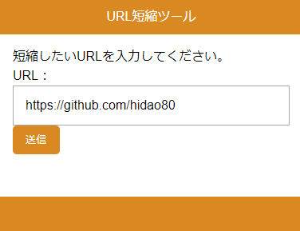
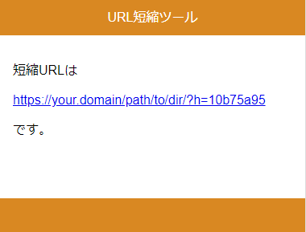

## url_shortener is 何

PHPとjsonファイルだけで動作する、短縮URL生成と本来のURLへのリダイレクトを行うツールです。

## 使い方

1. HTTPでアクセスできる任意のアドレスにファイルを展開します。
2. `index.php`と`hash.php`の`$base_url`の値を`index.php`へのURLにします。
3. `db.json`にその他のユーザの書き込み権限を与えます。このパーミッションは`666`と表記されるケースがあります。
4. `index.php`にアクセスし、テキストボックスに本来のURLを入力します（図1）。
5. 「送信」ボタンをクリックするか、エンターキーを押して本来のURLを登録します。  
    `index.php`と同じディレクトリにある`db.json`にダイジェストと本来のURLの組が登録されます。これを短縮URL解決のためのデータベースとします。
6. 「送信」ボタンをクリックした後、入力された本来のURLに対応する短縮URLが表示されます（図2）。リンクアドレスをコピーするなどして利用してください。

  
図1

  
図2

## 注意

1. 短縮URLが重複しないことを保証していません。
2. 部外者の勝手な利用を防ぐため、本ツールとは別の仕組みでアクセス制御を行ってください。
3. 書き込みロックを行っていないので、同時に登録が発生した場合、`db.json`が破損し復旧できなくなる可能性があります。
